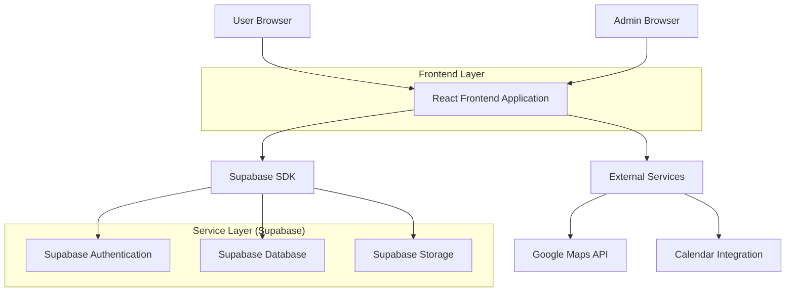
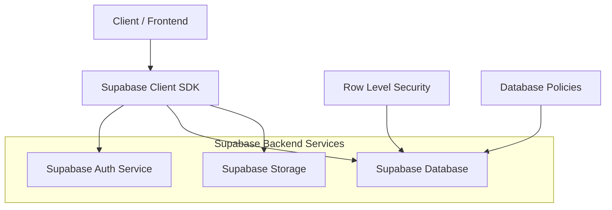
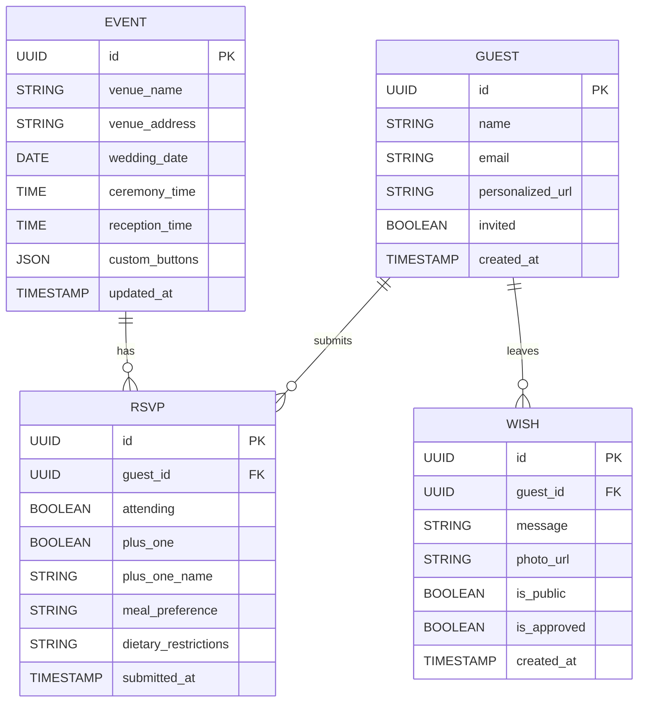

## 1. Architecture design



## 2. Technology Description
- Frontend: React@18 + tailwindcss@3 + vite
- Initialization Tool: vite-init
- Backend: Supabase (Authentication, Database, Storage)
- Key Dependencies: 
  - @supabase/supabase-js (database and auth)
  - react-i18next (multilingual support)
  - react-countdown (countdown timer)
  - lucide-react (icons)
  - date-fns (date formatting)
  - html2canvas (wish export functionality)

## 3. Route definitions
| Route | Purpose |
|-------|---------|
| / | Main wedding invitation page with all features |
| /admin | Admin dashboard for managing guests and RSVPs |
| /:guestName | Personalized invitation URL with embedded guest name |

## 4. API definitions

### 4.1 Core API

**Guest RSVP Submission**
```
POST /api/guests/rsvp
```

Request:
| Param Name| Param Type  | isRequired  | Description |
|-----------|-------------|-------------|-------------|
| guest_name | string | true | Name of the guest |
| email | string | false | Guest email address |
| attending | boolean | true | Whether guest will attend |
| plus_one | boolean | false | Whether bringing a guest |
| plus_one_name | string | false | Name of additional guest |
| meal_preference | string | false | Meal choice (vegetarian, vegan, etc.) |
| dietary_restrictions | string | false | Allergy or dietary notes |
| message | string | false | Optional message for couple |

Response:
| Param Name| Param Type  | Description |
|-----------|-------------|-------------|
| success | boolean | Submission status |
| guest_id | string | Unique guest identifier |

Example
```json
{
  "guest_name": "Sarah Johnson",
  "email": "sarah@email.com",
  "attending": true,
  "plus_one": true,
  "plus_one_name": "Michael Johnson",
  "meal_preference": "vegetarian",
  "dietary_restrictions": "Gluten-free",
  "message": "So excited to celebrate with you!"
}
```

**Virtual Wish Submission**
```
POST /api/wishes/submit
```

Request:
| Param Name| Param Type  | isRequired  | Description |
|-----------|-------------|-------------|-------------|
| guest_name | string | true | Name of well-wisher |
| message | string | true | Congratulatory message |
| photo_url | string | false | Optional photo URL |
| is_public | boolean | true | Whether to display publicly |

**Admin Authentication**
```
POST /api/admin/login
```

Request:
| Param Name| Param Type  | isRequired  | Description |
|-----------|-------------|-------------|-------------|
| password | string | true | Admin password |

## 5. Server architecture diagram



## 6. Data model

### 6.1 Data model definition


### 6.2 Data Definition Language

**Guests Table (guests)**
```sql
-- create table
CREATE TABLE guests (
    id UUID PRIMARY KEY DEFAULT gen_random_uuid(),
    name VARCHAR(255) NOT NULL,
    email VARCHAR(255),
    personalized_url VARCHAR(255) UNIQUE,
    invited BOOLEAN DEFAULT true,
    created_at TIMESTAMP WITH TIME ZONE DEFAULT NOW()
);

-- create index
CREATE INDEX idx_guests_personalized_url ON guests(personalized_url);
CREATE INDEX idx_guests_email ON guests(email);

-- grant permissions
GRANT SELECT ON guests TO anon;
GRANT ALL PRIVILEGES ON guests TO authenticated;
```

**RSVP Table (rsvps)**
```sql
-- create table
CREATE TABLE rsvps (
    id UUID PRIMARY KEY DEFAULT gen_random_uuid(),
    guest_id UUID REFERENCES guests(id) ON DELETE CASCADE,
    attending BOOLEAN NOT NULL,
    plus_one BOOLEAN DEFAULT false,
    plus_one_name VARCHAR(255),
    meal_preference VARCHAR(100),
    dietary_restrictions TEXT,
    submitted_at TIMESTAMP WITH TIME ZONE DEFAULT NOW()
);

-- create index
CREATE INDEX idx_rsvps_guest_id ON rsvps(guest_id);
CREATE INDEX idx_rsvps_attending ON rsvps(attending);

-- grant permissions
GRANT SELECT ON rsvps TO anon;
GRANT ALL PRIVILEGES ON rsvps TO authenticated;
```

**Wishes Table (wishes)**
```sql
-- create table
CREATE TABLE wishes (
    id UUID PRIMARY KEY DEFAULT gen_random_uuid(),
    guest_id UUID REFERENCES guests(id) ON DELETE CASCADE,
    message TEXT NOT NULL,
    photo_url TEXT,
    is_public BOOLEAN DEFAULT true,
    is_approved BOOLEAN DEFAULT false,
    created_at TIMESTAMP WITH TIME ZONE DEFAULT NOW()
);

-- create index
CREATE INDEX idx_wishes_guest_id ON wishes(guest_id);
CREATE INDEX idx_wishes_public ON wishes(is_public, is_approved);
CREATE INDEX idx_wishes_created_at ON wishes(created_at DESC);

-- grant permissions
GRANT SELECT ON wishes TO anon;
GRANT ALL PRIVILEGES ON wishes TO authenticated;
```

**Event Details Table (event_details)**
```sql
-- create table
CREATE TABLE event_details (
    id UUID PRIMARY KEY DEFAULT gen_random_uuid(),
    venue_name VARCHAR(255) NOT NULL,
    venue_address TEXT NOT NULL,
    venue_coordinates POINT,
    wedding_date DATE NOT NULL,
    ceremony_time TIME,
    reception_time TIME,
    dress_code VARCHAR(100),
    parking_info TEXT,
    accommodation_suggestions TEXT,
    custom_buttons JSONB,
    updated_at TIMESTAMP WITH TIME ZONE DEFAULT NOW()
);

-- insert default event data
INSERT INTO event_details (venue_name, venue_address, wedding_date, ceremony_time, reception_time) 
VALUES ('Elegant Garden Venue', '123 Romance Lane, Love City, LC 12345', '2024-06-15', '16:00', '18:00');

-- grant permissions
GRANT SELECT ON event_details TO anon;
GRANT ALL PRIVILEGES ON event_details TO authenticated;
```

**Row Level Security Policies**
```sql
-- RSVP policies
CREATE POLICY "Guests can view own RSVP" ON rsvps
    FOR SELECT USING (auth.uid() = guest_id OR EXISTS (
        SELECT 1 FROM guests WHERE personalized_url = current_setting('app.current_guest_url', true)
    ));

CREATE POLICY "Admins can manage all RSVPs" ON rsvps
    FOR ALL USING (auth.role() = 'authenticated');

-- Wishes policies  
CREATE POLICY "Public can view approved wishes" ON wishes
    FOR SELECT USING (is_public = true AND is_approved = true);

CREATE POLICY "Guests can submit wishes" ON wishes
    FOR INSERT WITH CHECK (true);

CREATE POLICY "Admins can moderate wishes" ON wishes
    FOR ALL USING (auth.role() = 'authenticated');
```