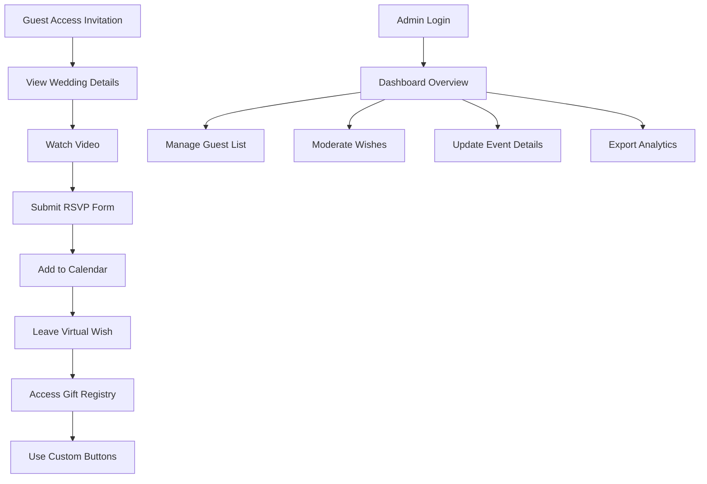

## 1. Product Overview
A modern, elegant one-page wedding invitation website that provides guests with all essential event information and interactive features. The platform streamlines RSVP management while offering personalized experiences for each guest with multilingual support and virtual engagement options.

This solution helps couples create beautiful digital invitations that are easy to share, track guest responses, and manage wedding details efficiently while providing guests with convenient access to all event information.

## 2. Core Features

### 2.1 User Roles
| Role | Registration Method | Core Permissions |
|------|---------------------|------------------|
| Guest | No registration required | View invitation, submit RSVP, add wishes, access gift registry |
| Admin (Couple) | Password-protected dashboard access | Manage guest list, view RSVPs, moderate wishes, update event details |

### 2.2 Feature Module
Our wedding invitation website consists of the following main pages:
1. **Wedding Invitation Page**: Hero section with couple names, venue details, countdown timer, embedded video, Google Maps, RSVP form, virtual wishes wall, gift registry links, and custom action buttons.
2. **Admin Dashboard**: Guest list management, RSVP tracking, wishes moderation, and event details editing.

### 2.3 Page Details
| Page Name | Module Name | Feature description |
|-----------|-------------|---------------------|
| Wedding Invitation | Hero Section | Display couple names, wedding date, and romantic background with smooth animations |
| Wedding Invitation | Venue & Time | Show ceremony and reception locations with full addresses, date, and start times |
| Wedding Invitation | Event Information | Present dress code, parking details, accommodation suggestions, and schedule timeline |
| Wedding Invitation | Video Player | Embed ceremony highlight video or pre-wedding message with custom thumbnail |
| Wedding Invitation | Calendar Integration | Generate downloadable .ics file with event details for Google/Apple/Outlook calendars |
| Wedding Invitation | Interactive Map | Display venue locations using Google Maps with directions and nearby landmarks |
| Wedding Invitation | Guest Personalization | Auto-populate guest names from URL parameters for unlimited personalized invitations |
| Wedding Invitation | Countdown Timer | Show live countdown to wedding date with days, hours, minutes, seconds |
| Wedding Invitation | Language Switcher | Toggle between multiple languages (English, Spanish, French, etc.) with persistent selection |
| Wedding Invitation | RSVP Form | Collect guest names, attendance status, meal preferences, plus-one details, and dietary restrictions |
| Wedding Invitation | Virtual Wishes | Allow guests to submit congratulatory messages with optional photos, displayed in real-time |
| Wedding Invitation | Gift Registry | Display links to online registries with direct shopping integration and cash gift options |
| Wedding Invitation | Custom Buttons | Up to 4 configurable action buttons for hotel booking, transportation, FAQ, or other needs |
| Admin Dashboard | Guest Management | View complete guest list, search/filter attendees, export contact information |
| Admin Dashboard | RSVP Analytics | Track attendance numbers, meal preferences, dietary restrictions with visual charts |
| Admin Dashboard | Wishes Moderation | Review, approve, or delete submitted wishes before public display |
| Admin Dashboard | Event Editor | Update venue details, times, event information, and custom button links |

## 3. Core Process
**Guest Flow**: Access personalized invitation → View wedding details → Watch video → Get directions → Submit RSVP → Add to calendar → Leave virtual wish → Access gift registry → Use custom action buttons

**Admin Flow**: Login to dashboard → Review guest RSVPs → Moderate wishes → Update event information → Export guest data → Monitor countdown and website analytics

## 4. User Interface Design

### 4.1 Design Style
- **Primary Colors**: Soft blush pink (#F4C2C2) and champagne gold (#D4AF37)
- **Secondary Colors**: Ivory white (#FFFFF0) and sage green (#87A96B)
- **Button Style**: Rounded corners with subtle shadow and hover animations
- **Typography**: Elegant serif font (Playfair Display) for headings, clean sans-serif (Open Sans) for body text
- **Layout**: Single-page scroll design with full-width sections and card-based content blocks
- **Icons**: Minimalist line icons with romantic flourishes, heart motifs, and floral elements

### 4.2 Page Design Overview
| Page Name | Module Name | UI Elements |
|-----------|-------------|-------------|
| Wedding Invitation | Hero Section | Full-screen romantic background image with couple names in elegant script, floating heart animations, smooth scroll indicator |
| Wedding Invitation | Venue & Time | Split-screen layout with venue photos, elegant typography for addresses, prominent date display with decorative borders |
| Wedding Invitation | Countdown Timer | Large digital display with flip animations, romantic background, responsive sizing for mobile devices |
| Wedding Invitation | Video Player | Custom play button overlay, responsive 16:9 aspect ratio, elegant loading animation |
| Wedding Invitation | RSVP Form | Multi-step form with progress indicator, elegant input fields with focus animations, submit confirmation with heart animation |
| Wedding Invitation | Virtual Wishes | Masonry grid layout for wishes, elegant card design with hover effects, photo upload preview |
| Admin Dashboard | Analytics Panel | Clean data visualization with romantic color scheme, responsive tables, export functionality |

### 4.3 Responsiveness
Desktop-first design approach with mobile optimization. Touch-friendly interactions for mobile devices, responsive typography scaling, and adaptive layouts for tablets and smartphones. All interactive elements optimized for touch targets with minimum 44px sizing.

### 4.4 3D Scene Guidance
Not applicable for this wedding invitation website project.